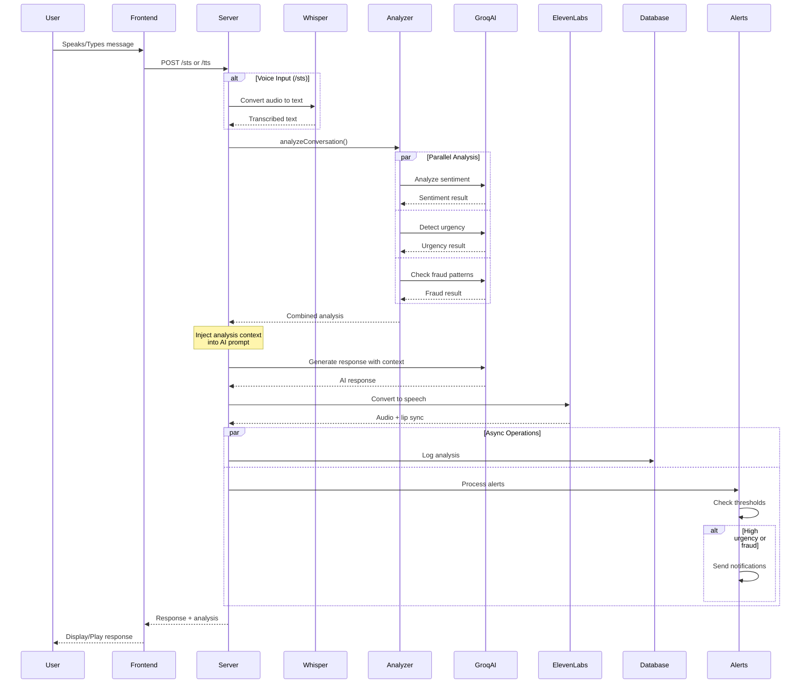
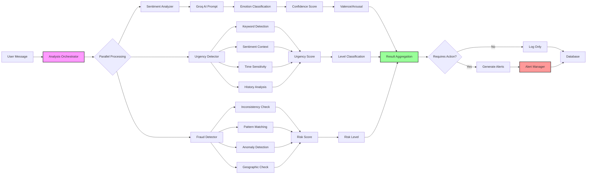
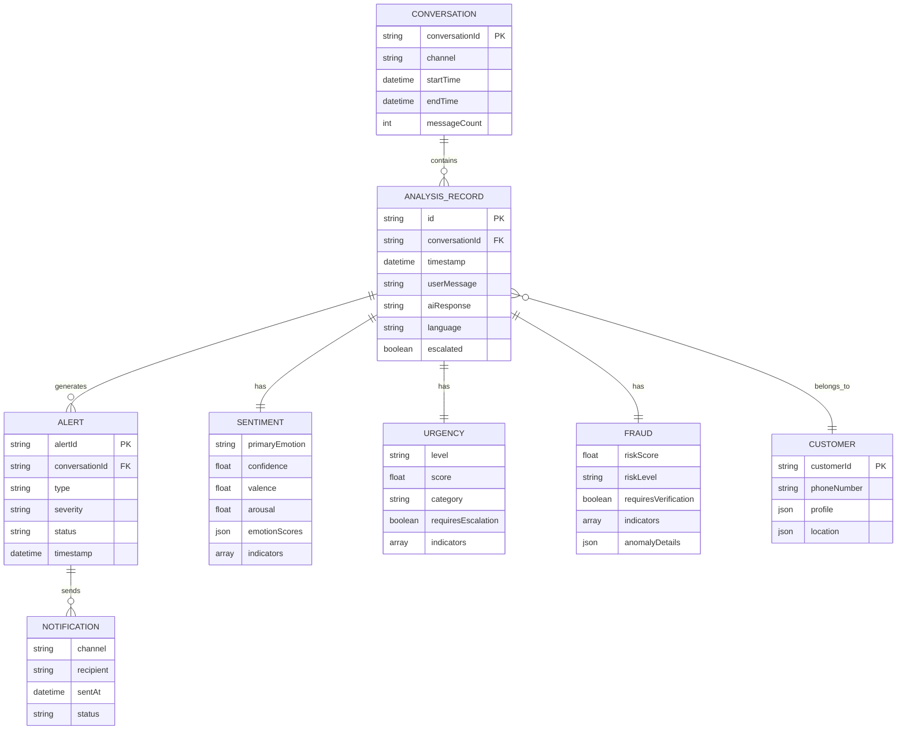
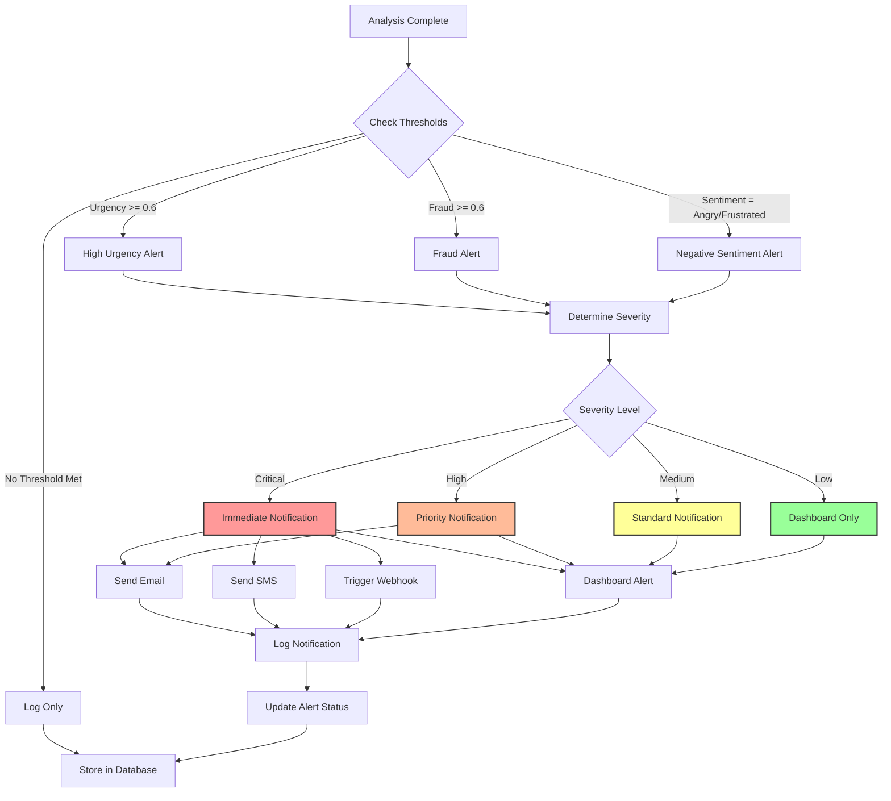
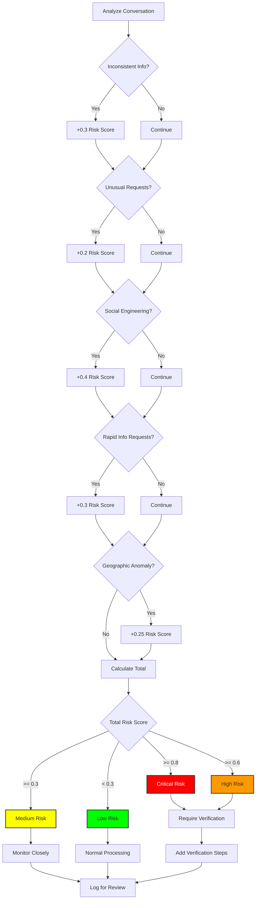
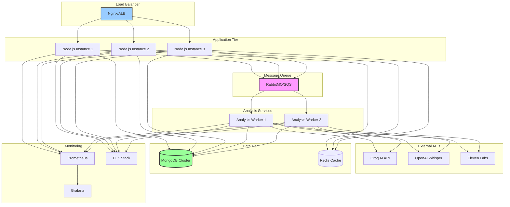

# System Diagrams

## System Architecture Diagram

```mermaid
graph TB
    subgraph "Client Layer"
        A[React Frontend<br/>3D Avatar]
        B[Vapi Voice Client<br/>Phone Calls]
    end
    
    subgraph "API Gateway"
        C[Express Server<br/>Port 3000]
    end
    
    subgraph "Conversation Endpoints"
        D[/tts Endpoint<br/>Text Input]
        E[/sts Endpoint<br/>Voice Input]
    end
    
    subgraph "Analysis Pipeline"
        F[Analysis Orchestrator]
        G[Sentiment Analyzer]
        H[Urgency Detector]
        I[Fraud Detector]
    end
    
    subgraph "AI Services"
        J[Groq AI<br/>LLaMA 3.3 70B]
        K[OpenAI Whisper<br/>STT]
        L[Eleven Labs<br/>TTS]
    end
    
    subgraph "Data Layer"
        M[(MongoDB<br/>Analysis Records)]
        N[Alert Queue]
        O[Analytics Store]
    end
    
    subgraph "Notification Layer"
        P[Email Service]
        Q[SMS Service]
        R[Webhook Service]
    end
    
    A --> C
    B --> C
    C --> D
    C --> E
    D --> F
    E --> K
    K --> F
    F --> G
    F --> H
    F --> I
    G --> J
    H --> J
    I --> J
    F --> D
    F --> E
    D --> J
    E --> J
    J --> L
    L --> A
    L --> B
    F --> M
    F --> N
    M --> O
    N --> P
    N --> Q
    N --> R
    
    style F fill:#f9f,stroke:#333,stroke-width:3px
    style G fill:#bbf,stroke:#333,stroke-width:2px
    style H fill:#bbf,stroke:#333,stroke-width:2px
    style I fill:#bbf,stroke:#333,stroke-width:2px
```

## Conversation Flow Sequence Diagram



## Analysis Pipeline Detail



## Data Model Relationships



## Alert Processing Flow



## Fraud Detection Decision Tree



## Deployment Architecture



